# 🌱 Mood Garden

**Live Demo:**  
[Mood Garden](https://mood-garden-beta.vercel.app/)

Mood Garden is a calming mood-tracking web application built during a 4-day MVP sprint.  
Users can log daily emotions using expressive flower icons, explore mood trends, and reflect on their emotional journey through a clean, responsive interface.

---

## 📸 Screenshots

> Store images inside a `/screenshots` folder in the root of the project.

### 🏠 Home
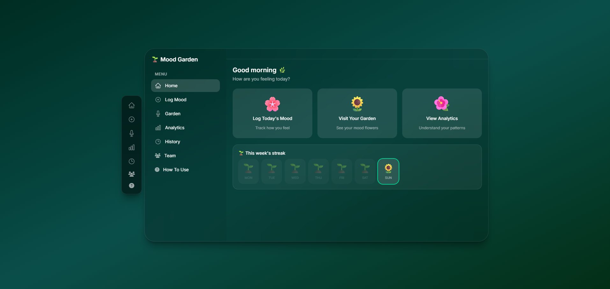

### 🌸 Log Mood
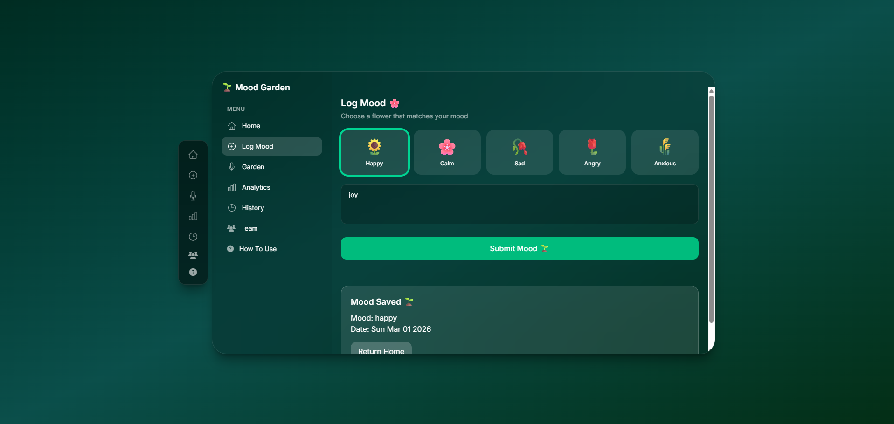

### 🌿 Garden
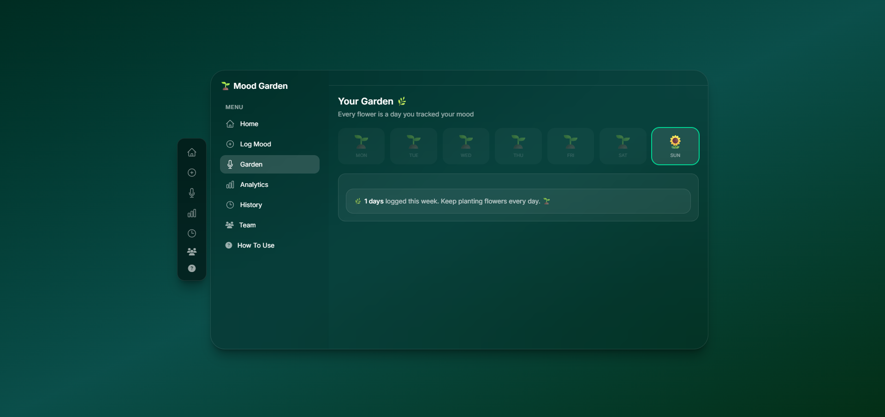

### 📊 Analytics
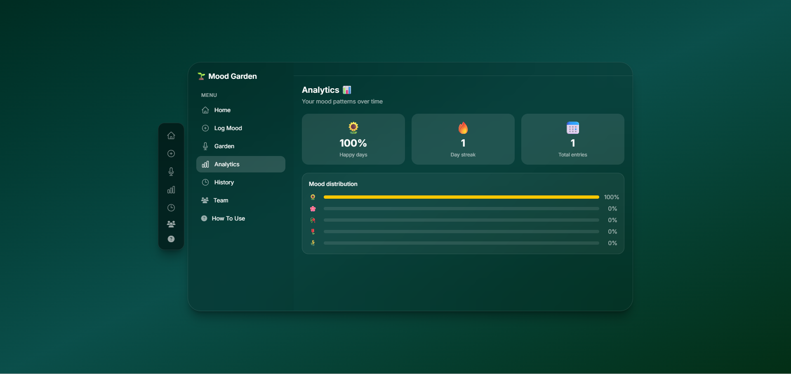

### 🕰️ History
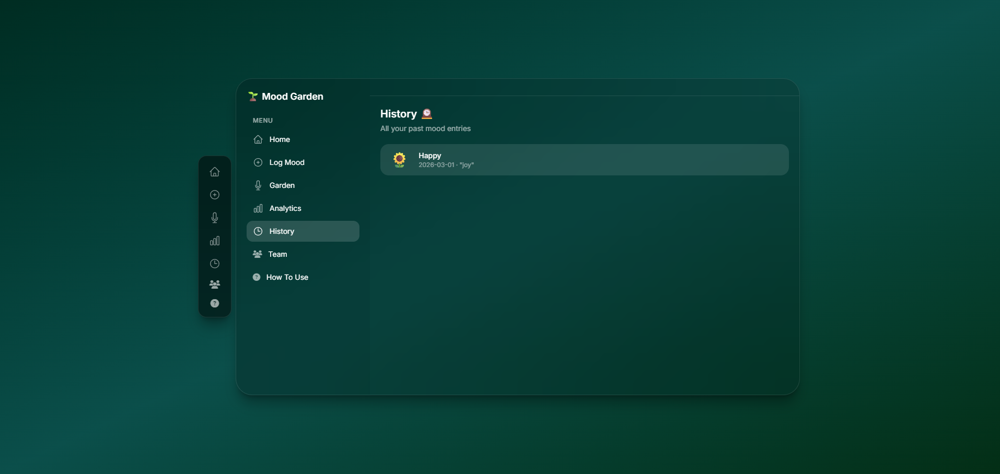

### 👥 Team
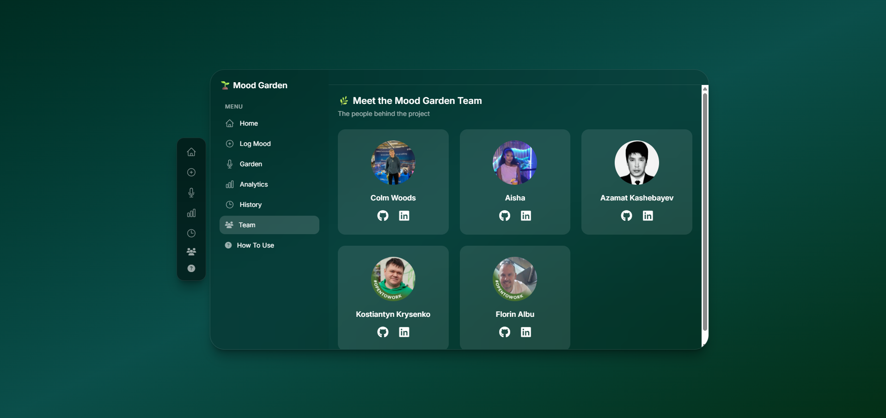

### ❓ How To Use
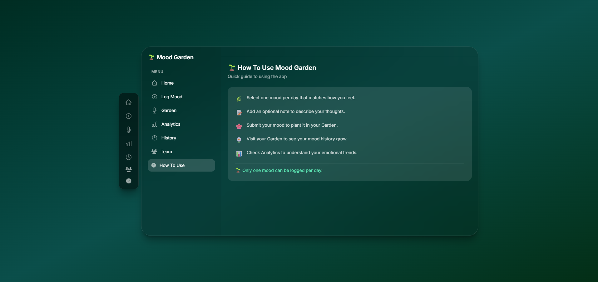

---

## 📱 Mobile Experience

Device: 375 x 824
Zoom: 100%

### 🏠 Home
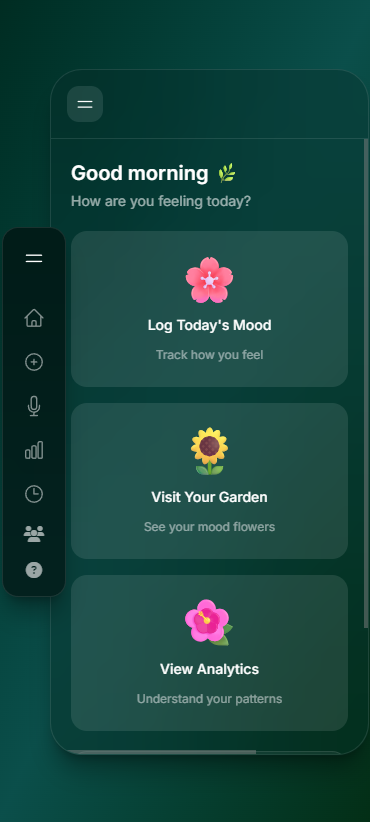

### 🌸 Log Mood
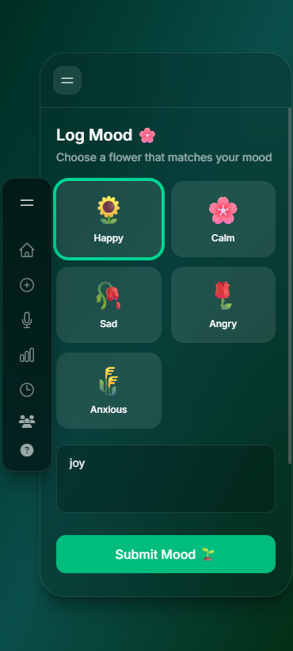

### 🌿 Garden
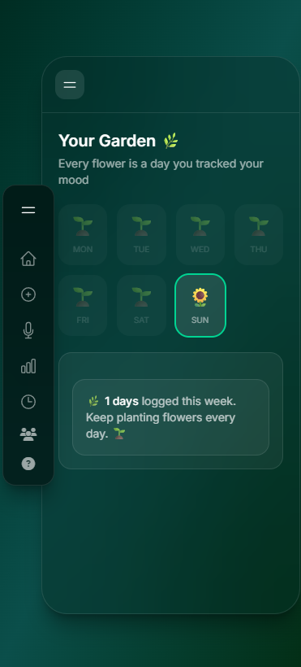

### 📊 Analytics
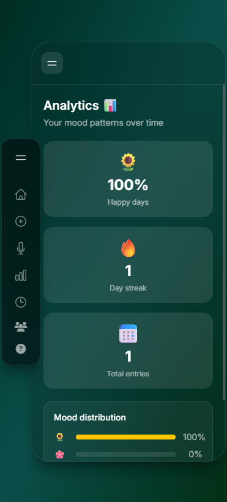

### 🕰️ History
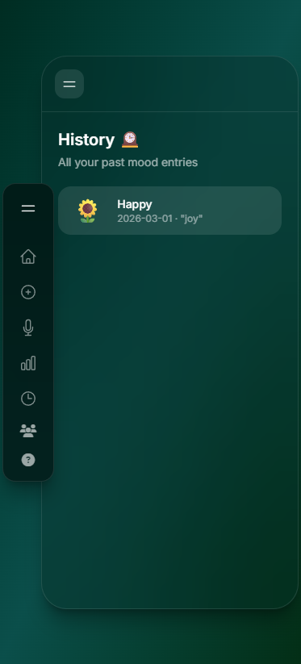

### 👥 Team
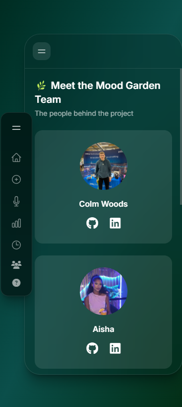

### ❓ How To Use
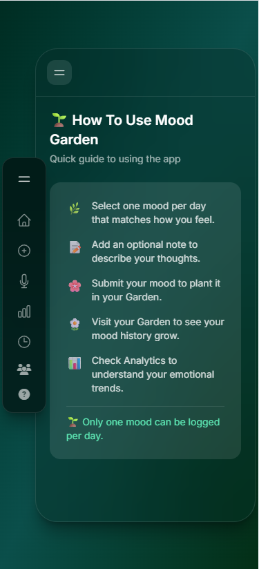


---

## 🌟 Features

- 🌸 Log daily moods with emoji-based input
- 🌿 Visual mood garden representation
- 📊 Analytics dashboard with mood distribution
- 🕰️ Historical mood tracking
- 👥 Dedicated Team page
- ❓ How To Use guide
- 💾 LocalStorage data persistence
- 📱 Fully responsive layout
- ⚡ Modular ES module structure

---

## 🛠️ Built With

- **Vite** – Frontend build tool
- **Vanilla JavaScript (ES Modules)**
- **TailwindCSS** – Utility-first styling
- **Font Awesome** – Icon library
- **LocalStorage API** – Persistent browser storage
- **Vercel** – Deployment platform

---

## 📂 Project Structure

```
📦 mood-garden
 ┣ 📂 .github
 ┃ ┗ 📂 ISSUE_TEMPLATE
 ┃    ┗ 📄 title-component.md
 ┣ 📂 public
 ┃ ┣ 📂 images
 ┃ ┗ 📄 icon.svg
 ┣ 📂 screenshots
 ┃ ┣ 📄 analytics.png
 ┃ ┣ 📄 garden.png
 ┃ ┣ 📄 history.png
 ┃ ┣ 📄 home.png
 ┃ ┣ 📄 how-to-use.png
 ┃ ┣ 📄 log-mood.png
 ┃ ┣ 📄 team.png
 ┃ ┣ 📄 mobile-analytics.png
 ┃ ┣ 📄 mobile-garden.png
 ┃ ┣ 📄 mobile-history.png
 ┃ ┣ 📄 mobile-home.png
 ┃ ┣ 📄 mobile-how-to-use.png
 ┃ ┣ 📄 mobile-log-mood.png
 ┃ ┗ 📄 mobile-team.png
 ┣ 📂 src
 ┃ ┣ 📂 pages
 ┃ ┃ ┣ 📄 analytics.js
 ┃ ┃ ┣ 📄 garden.js
 ┃ ┃ ┣ 📄 history.js
 ┃ ┃ ┣ 📄 home.js
 ┃ ┃ ┣ 📄 howtouse.js
 ┃ ┃ ┣ 📄 mood.js
 ┃ ┃ ┗ 📄 team.js
 ┃ ┣ 📂 scripts
 ┃ ┃ ┣ 📄 addToStorage.js
 ┃ ┃ ┗ 📄 constants.js
 ┃ ┣ 📂 styles
 ┃ ┃ ┗ 📄 main.css
 ┃ ┣ 📄 counter.js
 ┃ ┣ 📄 main.js
 ┃ ┣ 📄 storage.js
 ┃ ┗ 📄 style.css
 ┣ 📄 .gitignore
 ┣ 📄 eslint.config.js
 ┣ 📄 index.html
 ┣ 📄 package-lock.json
 ┣ 📄 package.json
 ┣ 📄 README.md
 ┗ 📄 vite.config.js
```

---

## 🚀 Getting Started

### 1️⃣ Clone the repository

```bash
git clone https://github.com/colmwoods/mood-garden.git
cd mood-garden
```

### 2️⃣ Install dependencies

```bash
npm install
```

### 3️⃣ Run development server

```bash
npm run dev
```

Visit in browser:

```
http://localhost:5173
```

---

## 📦 Production Build

To build for production:

```bash
npm run build
```

The optimized files will be generated in the `dist/` folder.

---

## 🧭 Navigation System

Mood Garden uses a lightweight client-side navigation system:

- Buttons use `data-page="pageName"`
- Pages match `<div id="page-pageName">`
- `navigateTo(pageId)` controls dynamic page switching
- Both sidebars share the same navigation logic

This keeps routing simple, modular, and dependency-free.

---

## 💾 Data Storage

Mood entries are stored in the browser using `localStorage`.

Each entry contains:
- Mood type
- User note
- Date

Data persists across sessions without requiring a backend.

---

## 🧠 Future Improvements

- 📈 Chart.js integration for interactive analytics
- 🔐 User authentication system
- ☁️ Backend + database integration
- 🌈 Theme switching
- 🧪 Unit testing
- 📊 Exportable mood reports

---

## 👥 Team & Sprint

**4-Day MVP Sprint | 5 Developers**

- [Colm Woods](https://github.com/colmwoods)
- [Florin](https://github.com/11florin)
- [Kostiantyn](https://github.com/barkode)
- [Azamat](https://github.com/akashebaev-ux)
- [Aisha](https://github.com/aishieee)

---

## 📄 License

MIT License © 2026 Colm Woods
